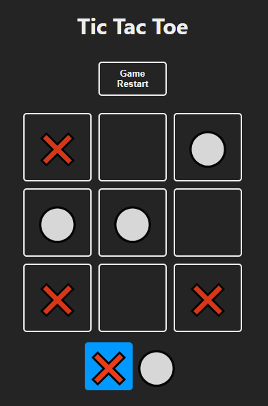
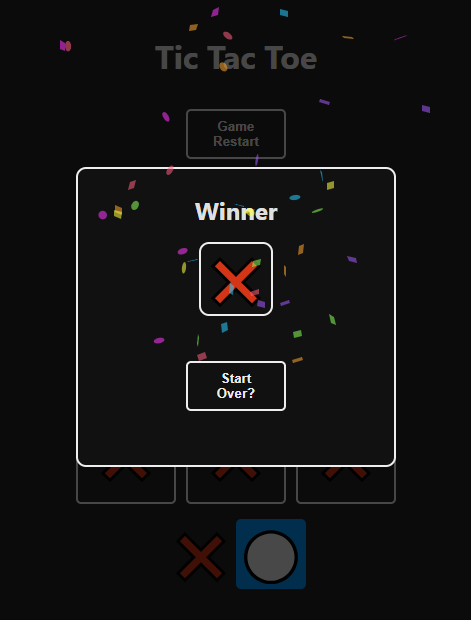

# Tic Tac Toe

This is a simple game developed with React + JavaScript. This game
uses local storage so game status will persist in time.
Developed this project with the objective of practicing React + JS and apply programming logic, in a way that the main problem is broken down into smaller problems, this way we create a logic that can be applied to almost every web dev problem.
